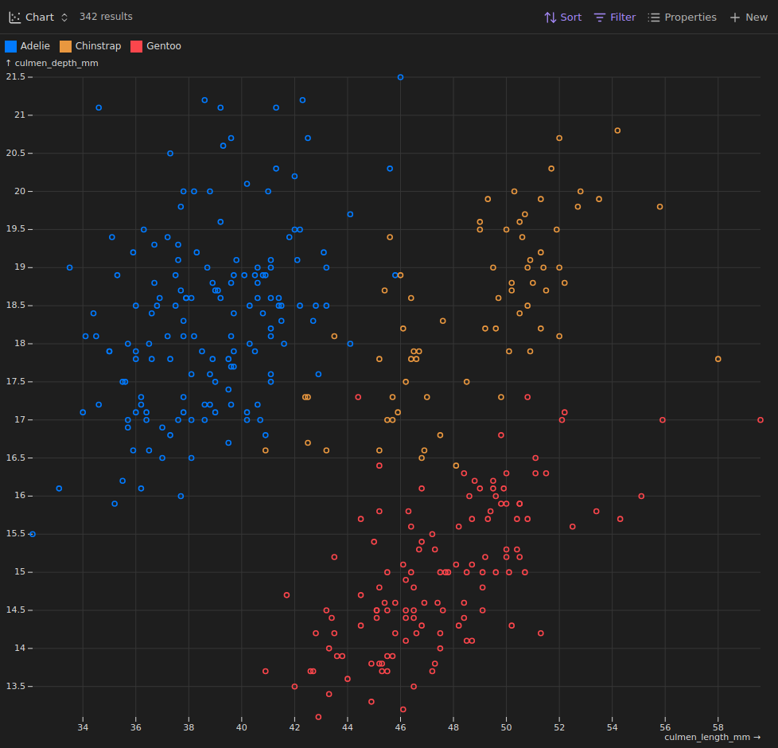
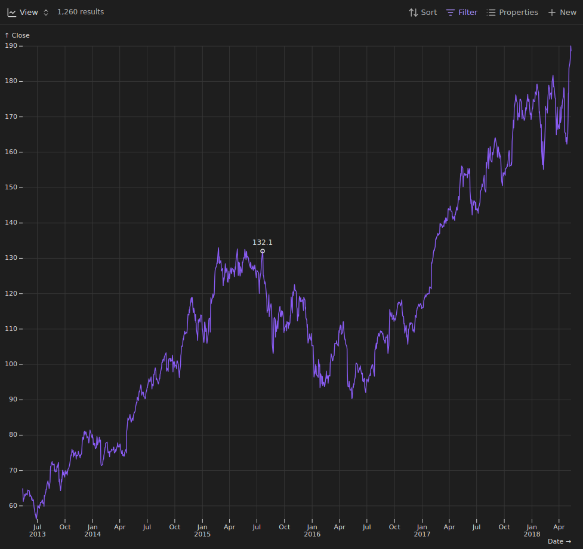
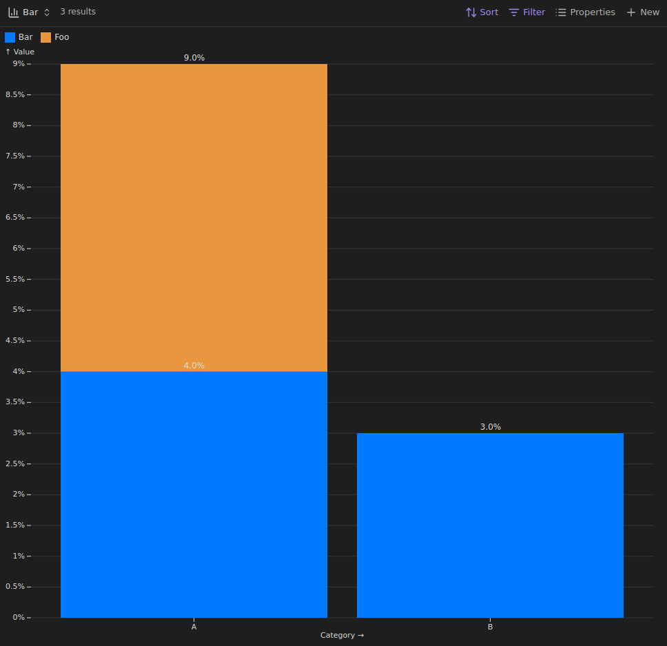

# Bases Charts

This plugin for Obsidian adds three new bases views: Scatter Charts, Line Charts, and Bar Charts.

## Usage

First you need a [Base](https://help.obsidian.md/bases), then from there you can (with the plugin installed and enabled) create thee new bases views: Scatter Charts, Line Charts, and Bar Charts. 
Next you need to select the properties or formulas used for the X and Y values. Currently the plugin only supports a 1-to-1 mapping of notes to data points. 
On the X axis, [`Number`, `Date`, and `String`](https://help.obsidian.md/bases/functions) are supported. On the Y axis the plugin only supports [`Number`](https://help.obsidian.md/bases/functions). 
Data points can be grouped into multiple colors via a `Group by` sort.

### Scatter Charts

### Line Charts

### Bar Charts

## Installation

Currently only via BRAT.

## License

[GPL-3.0](https://choosealicense.com/licenses/gpl-3.0/)

## Contributions

Thank you for wanting to contribute to this project.

Contributions are always welcome. If you have an idea, feel free to open a feature request under the issue tab or even create a pull request.